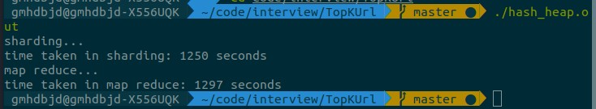
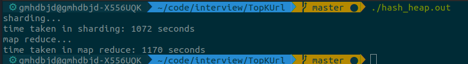
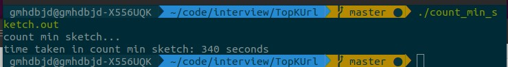
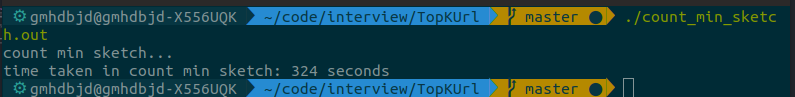
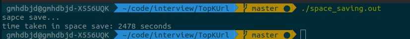
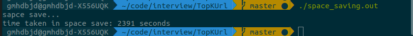
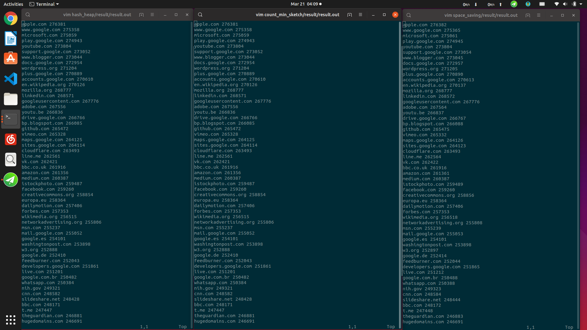

# TopKUrl
Interview of PingCAP

# 要求
100GB的url文件，使用1GB内存计算出出现次数top100的url和出现的次数。

# 截止时间
3月21日晚上24:00前，通过GitHub提交代码链接。

# 实现方案
  - [x] 哈希加最小堆
  - [x] Count-Min Sketch
  - [x] Space Save

# 实现算法
- 确定性算法：
  - 哈希加最小堆
    > 使用std::hash将url切分到n文件中，使用一个全局最小堆，对每个文件用std::map统计url和对应的数量，遍历哈希表，将结果插入堆中，保持堆大小为K。n次遍历之后堆中存放的即TopK。
    
    总共需要200GB的磁盘读操作和100GB的磁盘写操作。

- 非确定性算法：
  - Count-Min Sketch
    > 类似Bloom filter的思想，采用d个hash函数和m个切分，维护一个m*d的二维向量V，对于每个url，使用d个hash函数依次hash并模m，将V[hash_key][hash_value]的值加一。重新遍历每个url，对于每个url，找到最小的V[hash_key][hash_value]，该值即url的次数，并维护一个大小为K最小堆保存结果。为了产生多个hash函数，使用std::hash得到每个url的种值，使用std::minstd_rand作为伪随机数生成器生成“哈希值”（故此Sketch实际只使用了一个hash函数）

    总共需要100GB的磁盘读操作。输出结果url的出现次数将会略大于实际次数。

  - Space Save
    > 维护一个最小堆，当从数据流中看到一个url时，如果堆中已经存在，则增加url的值，否则就替换掉堆顶元素，并将值设为原堆顶元素的值加1。

    总共需要100GB的磁盘读操作。输出结果url的出现次数将会略大于实际次数。

以上三个算法都需用到最小堆，且第二和第三个算法需要对堆进行查找和增值，所以自我实现了一个最小堆。自定义Stream，每次读写缓存16KB的block。

# 测试结果

## 测试环境
ubuntu 18.04, 128GB固态硬盘
由于磁盘空间较小，使用10GB的文件进行测试，并用***unix***的***ulimit -v 100000***将内存限制为100MB

## 测试数据
从[moz](https://moz.com/top500)得到top500的url，通过generate_data.cpp产生随机分布，假设top500的url占全网总流量的1%,其他99%的url随机产生，并且top500之间的权重为等差数列（第一的url权重为500，第2的url权重为499，...，第500的url权重为1）, 这样我们得到总权重(1+500)\*500/2\*10=1252500，第100的url概率约为P=401/1252500

- 对于哈希加最小堆的算法，将10GB的文件分成500个小文件，每个文件20MB
- 对于Count-Min Sketch算法，选取d=10，m=1000000，整个Sketch占用内存为10\*1000000\*4=40MB，这样保证99%的概率下，总误差（所有元素查询误差的之和）小于0.027%
- 对于Space Save算法，将堆的大小设为3200 > 1252500/401，保证堆中后100的url是正确的。

## 运行时间
- hash_heap总运行时间为42分钟
    
  IO优化后总运行时间37分钟  
  

- Count-Min Sketch总运行时间5.6分钟  
    
  IO优化后总运行时间5.4分钟  
  

- Space Save总运行时间为41分钟  
    
  IO优化后总运行时间40分钟  
  

可以看出Count-Min Sketch效率最高，hash_heap由于500个文件的读写操作，所用时间最多，Space Save因为堆中元素较多，每个url都要一次插入或增值，故效率不高，如果我们假设前500的url占全网总流量的99%，那么堆的大小只需100，效率将大幅提高。

## 运行结果
通过将后两个算法结果和hash_heap结果（左1）比较，可以看出最后排行是正确的，Count-Min Sketch中url出现的次数基本正确，而Space Save中的次数偏大。

# 进一步优化（未完成）
- 分布式map_reduce
- 多进程（消耗时间的主要是磁盘IO，故提升应该不大）